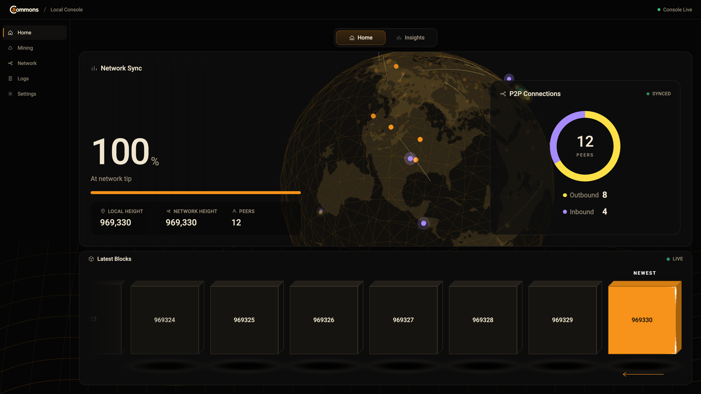
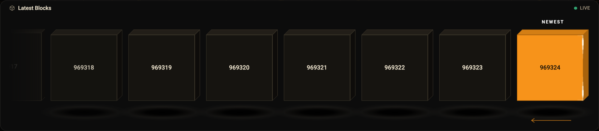
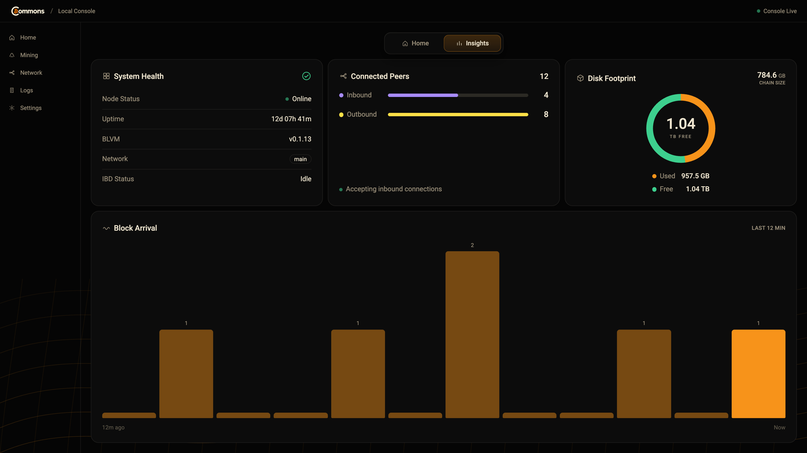
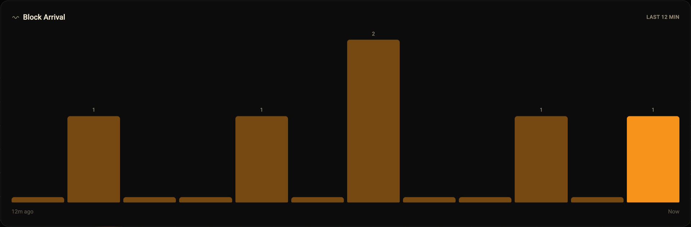
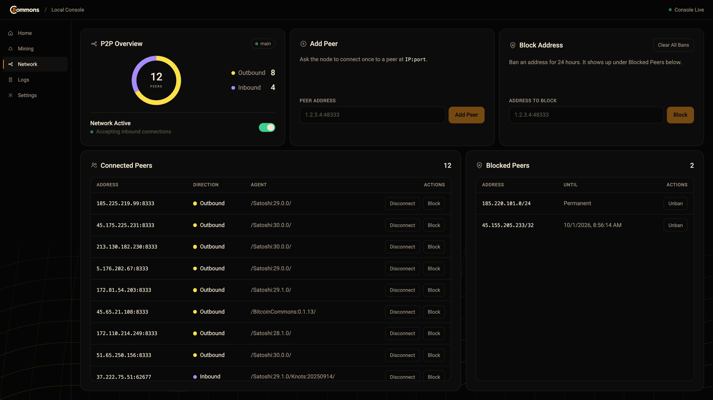
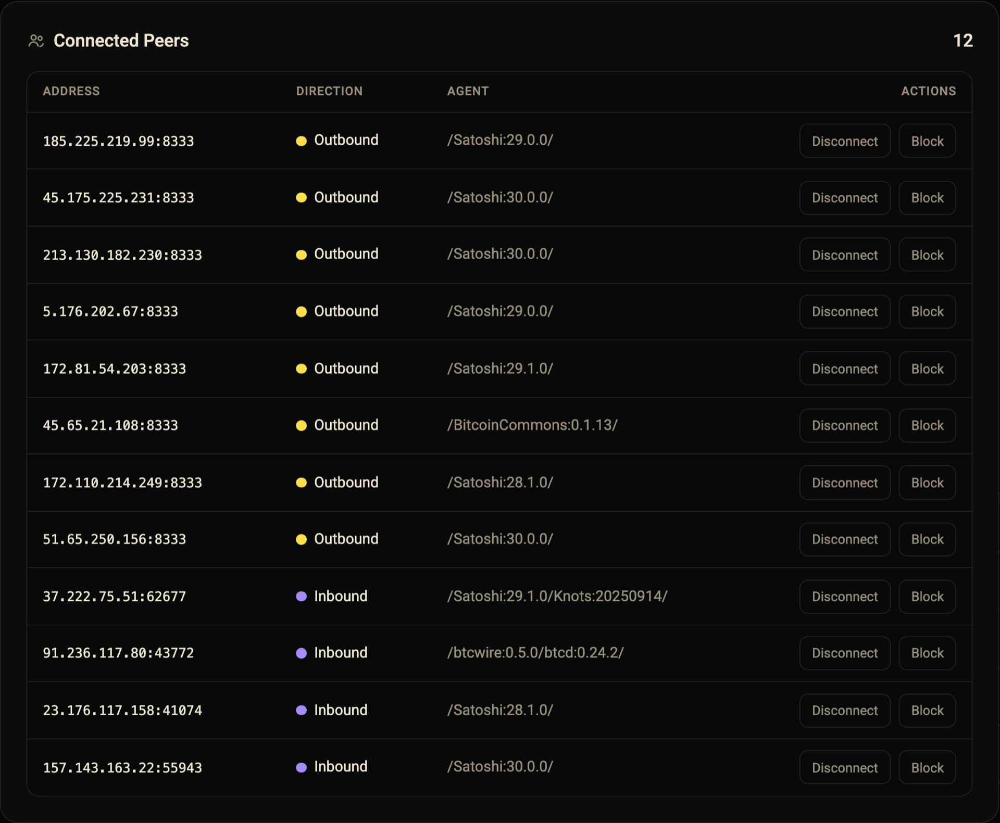
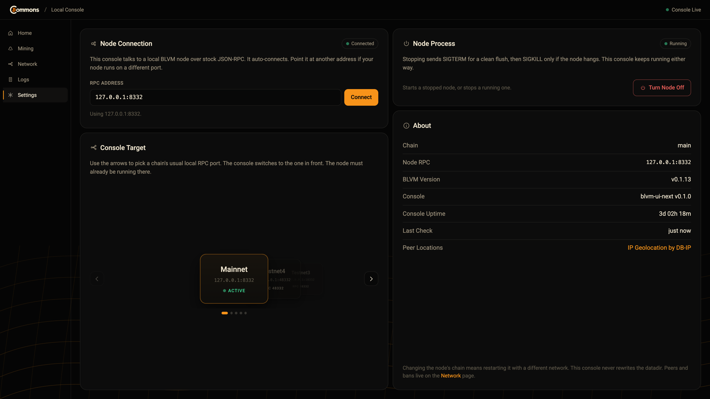

# blvm-ui

Local operator console for a [BLVM](https://thebitcoincommons.org/) node.



`blvm-ui` is an **optional** process. It is not consensus code and the node does not need it to sync. It talks to an
already-running node over stock JSON-RPC and serves a single-page dashboard in your browser, by default at
**http://127.0.0.1:3849**.

It is a Svelte 5 + Tailwind v4 front end served by a small Rust host. The host polls the node once a second, keeps a
little state of its own (block history, peer locations, node power), and hands the page one JSON snapshot.

This repository is the console only. The node, protocol, and consensus live in the rest of the Bitcoin Commons stack.

> The crate and binary are still named `blvm-ui-next` from development. Commands below use that name.

## The console

### Home

Sync progress for the chain the node is on, local and network height, and a live P2P ring showing the inbound and
outbound split. Behind it, a globe shows where your peers are (country level, offline lookup) and where you are.

The **Latest Blocks** rail slides a new block in as the node connects it. While the node is catching up, fast
stretches of blocks show up as ranges instead of one tile per height.

| Synced | Initial block download |
|---|---|
|  |  |



### Insights

System health (status, uptime, BLVM version, chain, IBD state), inbound vs outbound peers, how much disk the chain
uses next to the free space on its volume, and how many blocks arrived in each of the last 12 minutes.





### Network

Everything about peers: the P2P overview with a switch to turn networking off, add a peer, block an address for
24 hours, and full lists of connected peers (address, direction, user agent) and blocked ones, with disconnect, block
and unban actions.





### Settings

Which node RPC the console talks to, a carousel of the usual local RPC ports per chain (Mainnet, Testnet4, Testnet3,
Signet, Regtest), starting and stopping the node process, and version / uptime details.



### Mining and Logs

**Mining** introduces the Stratum V2 endpoint and the Commons pool. It is informational for now. **Logs** gives the
commands to run the node with verbose output, save it, and follow it, plus the log lines worth watching for. The
console does not stream node logs yet.

### Status lights

- **Green**: RPC up, at the tip, has peers.
- **Amber**: syncing (IBD), catching up after being synced, no peers, or still looking for the node.
- **Red**: the node is down or not answering RPC (**Frozen** when the port is open but RPC hangs).

The console does **not** die when the node dies. It keeps the last known numbers, dims them, and offers a manual
connect field.

## Requirements

- Rust 1.88 or newer
- Node.js 20 or newer (to build the front end)
- A node with JSON-RPC listening. The default target is a BLVM Testnet4 node at `127.0.0.1:48332`; mainnet is
  `127.0.0.1:8332`. Bitcoin Core and Knots work too; give the console their RPC login (see [Configuration](#configuration)).
- Unix (Linux or macOS) for starting and stopping the node from Settings. Everything else works on Windows too.

## Quick start

```bash
git clone https://github.com/BTCDecoded/blvm-ui.git
cd blvm-ui

# 1. Build the front end (writes web/dist)
cd web && npm install && npm run build && cd ..

# 2. Run the console against your node
BLVM_UI_RPC=127.0.0.1:8332 cargo run --release
```

Open **http://127.0.0.1:3849**. The console auto-connects to `BLVM_UI_RPC` and you can switch targets from Settings.

Optional: download the peer location database so peers show up on the globe (see [Peer locations](#peer-locations)).

## Development

Run the Rust host and the Vite dev server side by side. Vite proxies `/api` to the host, so the page reloads live as
you edit.

```bash
# terminal 1: host on :3849
BLVM_UI_RPC=127.0.0.1:48332 cargo run

# terminal 2: live-reloading front end on http://127.0.0.1:5174
cd web && npm install && npm run dev
```

```bash
cargo test          # host tests (feed, sync %, persistence, geo, process control)
cd web && npm run build
```

### Mock mode (no node needed)

`web/mock/server.mjs` serves the built page with a fake `/api/status` that looks like a real mainnet node: the current
mainnet tip (fetched from mempool.space at start, with a fallback), 8 outbound and 4 inbound peers around the world,
disk usage, and a new block every minute.

```bash
cd web
npm run build
npm run mock                         # http://127.0.0.1:3850
MOCK_SCENARIO=ibd npm run mock       # mid initial block download instead
```

| Variable | Meaning | Default |
|---|---|---|
| `MOCK_PORT` | listen port | `3850` |
| `MOCK_SCENARIO` | `synced` or `ibd` | `synced` |
| `MOCK_TIP` | tip height; skips the network lookup | live tip |
| `MOCK_BLOCK_SECS` | seconds between new blocks when synced, `0` to freeze | `60` |

### Screenshots

```bash
cd web && npm run build && npm run screenshots
```

Starts its own mock server, then captures every page and the main cards at 1920×1080 (2× pixel density) in both the
synced and syncing states, into `screenshots/`. `SCREENSHOT_SIZE=1440x900` gives Umbrel store gallery sizes. It uses a Chromium-family browser already installed on the machine
(Chrome, Chromium, Brave or Edge). Set `BROWSER_PATH` to choose one, or `SCREENSHOT_DIR` to change the output folder.
The images in `docs/screenshots/` are picked from that output.

## Running in production

A release build needs the binary and the built front end next to each other:

```bash
cd web && npm ci && npm run build && cd ..
cargo build --release
mkdir -p dist/blvm-ui && cp target/release/blvm-ui-next dist/blvm-ui/ && cp -r web/dist dist/blvm-ui/web
cp geo/zone.tab dist/blvm-ui/  # optional; the time zone table is also built in
```

The host looks for the page in `$BLVM_UI_WEB_DIR`, then `web/`, `dist/` or `web/dist/` next to the binary, then this
crate's `web/dist`.

### Docker

The `Dockerfile` builds the page, the location database and the binary into a small Debian image that runs as
UID 1000 and keeps its block history in `/data`. The Rust binary is cross-compiled, so a multi-arch build does not
need emulation.

```bash
docker buildx build --platform linux/amd64,linux/arm64 -t ghcr.io/btcdecoded/blvm-ui:dev .

docker run --rm -p 3849:3849 -v blvm-ui:/data \
  -e BLVM_UI_RPC=host.docker.internal:8332 \
  -e BLVM_UI_RPC_USER=user -e BLVM_UI_RPC_PASS=pass \
  ghcr.io/btcdecoded/blvm-ui:dev
```

The **Docker image** GitHub workflow (`.github/workflows/docker.yml`) builds both architectures on every push and
pull request and publishes to `ghcr.io/btcdecoded/blvm-ui`:

| Push | Image tags |
|---|---|
| tag `v0.1.0` | `0.1.0`, `latest` |
| `main` | `main`, `sha-<commit>` |
| pull request | built, not pushed |

The run summary prints the multi-arch digest to pin in the Umbrel app's `docker-compose.yml`. Starting and stopping
the node from Settings does not work inside a container, because the node runs in a different one.

### Building for other systems

The platform is picked by the Rust build target, so Linux, Docker (Umbrel, Start9) and macOS builds come from the same
code:

```bash
cargo build --release                                     # this machine
cargo build --release --target x86_64-unknown-linux-gnu   # Linux x86_64
cargo build --release --target aarch64-unknown-linux-gnu  # Linux ARM64
```

(Install a target once with `rustup target add …`.)

| Piece | Linux (incl. Docker) | macOS / other Unix | Windows |
|---|---|---|---|
| Find / stop / restart the node | reads `/proc` (no `lsof`/`ps` needed), falls back to them | `lsof` + `ps` | not supported |
| Block history file | `$XDG_STATE_HOME` or `~/.local/state/blvm-ui-next` | `~/Library/Application Support/blvm-ui-next` | `%APPDATA%\blvm-ui-next` |
| Time zone for the "You!" dot | `TZ`, `/etc/localtime`, `/etc/timezone` | `TZ`, `/etc/localtime` | `TZ` |

For Umbrel / Start9 containers, which usually run in UTC, use `BLVM_UI_SELF_GEO=fixed:…` or pass the host's `TZ`, and
point `BLVM_UI_STATE_DIR` at the app's persistent volume so history survives image updates.

## Configuration

Runtime only:

| Variable | Meaning | Default |
|---|---|---|
| `BLVM_UI_LISTEN` | address the console listens on | `127.0.0.1:3849` |
| `BLVM_UI_RPC` | node JSON-RPC address | `127.0.0.1:48332` |
| `BLVM_UI_RPC_USER` / `BLVM_UI_RPC_PASS` | RPC login, for nodes that require one (Bitcoin Core, Umbrel) | none |
| `BLVM_UI_RPC_COOKIE` | path to the node's `.cookie` file, used when no user is set; re-read on every call | none |
| `BLVM_UI_WEB_DIR` | folder holding the built page | see above |
| `BLVM_UI_NODE_BIN` | node binary used by **Turn Node On** | auto-detected |
| `BLVM_UI_NODE_CWD` | working directory for that node | auto-detected |
| `RUST_LOG` | host log filter | `blvm_ui_next=info` |

These can also be baked in **at build time** (`BLVM_UI_SELF_GEO=fixed:52.52,13.405,Berlin cargo build --release`). A
value set at runtime wins.

| Variable | Values | Default |
|---|---|---|
| `BLVM_UI_SELF_GEO` | `auto` (node-reported IP, else time zone), `ip`, `timezone`, `fixed:LAT,LON[,Label]`, `off` | `auto` |
| `BLVM_UI_STATE_DIR` | folder for `feeds.json` (Latest Blocks history) | per-user folder above |
| `BLVM_UI_GEO_DB` | path to the `.mmdb` location file | `geo/dbip-country-lite.mmdb` next to the binary, then this crate's `geo/` |

The console only listens on localhost by default. It can start and stop your node and change peer settings, so do not
expose it to a network you do not trust.

## Peer locations

Offline, country-level IP lookup with the DB-IP Country Lite database (CC BY 4.0). It is a 4 MB download, about 8 MB
unpacked, and git-ignored. Download it once into `geo/`:

```bash
curl -L -o geo/dbip-country-lite.mmdb.gz https://download.db-ip.com/free/dbip-country-lite-YYYY-MM.mmdb.gz
gunzip geo/dbip-country-lite.mmdb.gz
```

Each country is drawn at the average of its time zone cities (from the built-in tzdb table), and peers in the same
country get a small fixed offset so their dots do not stack. The larger City Lite file also works; the country file is
used first when both are present. Without a file, the console runs normally and peers just have no dot on the globe.

## Latest Blocks history

Kept in `feeds.json`, one entry per node RPC address, so it survives page reloads, console restarts, rebuilds and
network switches. It is only cleared when:

- the node's height stays well below the saved height for about 15 seconds (the chain data dir was wiped), or
- the node reports a different chain on the same RPC address.

A node that briefly reports height 0 while restarting does not clear it.

## HTTP API

The page only uses these; they are handy for scripts too.

| Route | Does |
|---|---|
| `GET /api/status` | the full snapshot the page renders (sync, peers, disk, feed, health) |
| `POST /api/connect` `{"rpc":"host:port"}` | point the console at another node |
| `POST /api/node` `{"action":"toggle"}` | start or stop the node process |
| `POST /api/rpc` `{"method":…,"params":[…]}` | pass-through for peer settings: `addnode`, `setban`, `clearbanned`, `disconnectnode`, `setnetworkactive` |

## Layout

```
src/          Rust host: HTTP server, RPC polling, snapshot, block feed, geo lookup, node process control
web/src/      Svelte front end (App.svelte + one panel per page in lib/)
web/public/   logo, fonts, globe texture
web/mock/     mock API server and screenshot script
geo/          time zone table (+ the optional .mmdb you download)
docs/         screenshots used in this README
Dockerfile    multi-arch container image (see Docker)
```

## License

MIT. See [LICENSE](LICENSE).
